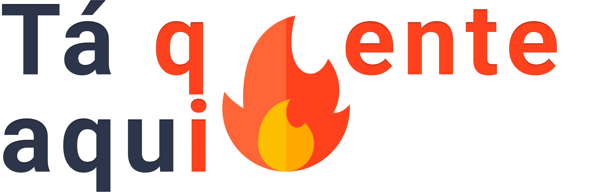
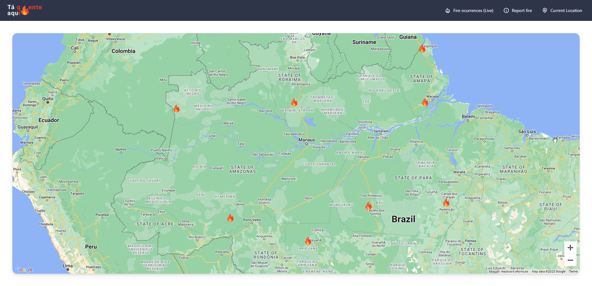

<h1 align="center">
    <br>
    
    <br><br>
</h1>

<p align="center">
    A brief description of what this project does and who it's for
    <br><br>
    <a href="https://opensource.org/licenses/MIT">
        
    </a>
    <br><br>
</p>

## ✨ Features

- Register a fire incident
- View the entire world map and understand where fires are occurring


## 📸 Preview



<br>

## ⚡ Tech Stack

**Client:**  Vue.js,  TypeScript,  Tailwind,  DaisyUI,

**Server:** PHP Laravel, Firebase

<br>

## 🗂 How to Use

Run Locally
```bash
# Clone the project
  git clone https://github.com/Merieli/hackaton-nasa-front.git

# Go to the project directory
  cd hackaton-nasa-front

# Install dependencies
  npm install

# Start the server
  npm run dev
```

work
```bash
# Commit changes
  npm run commit
```

## :octocat: Contributing

This project is for study purposes, so contact me and let me know your ideas.
All kinds of contributions are very welcome and appreciated!

- ⭐️ Star the project
- 🐛 Find and report issues
- 📥 Submit PRs to help solve issues or add features
- ✋ Influence the future of project with feature requests

-------------------------------------
```diff
Made by 🤍 Merieli Manzano
```

<p align="right">(<a href="#top">back to top</a>)</p>
